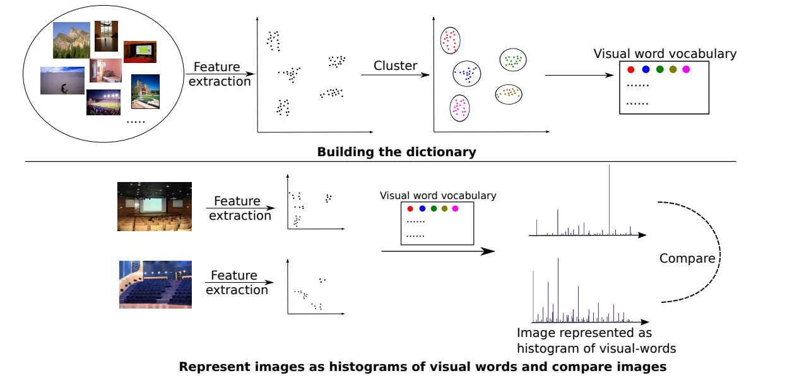
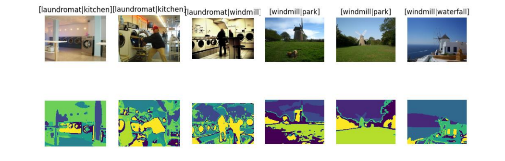

<!--https://github.com/othneildrew/Best-README-Template-->

  <h3 align="center">Spatial Pyramid Matching for Scene Classification</h3>
  

    16-720 Computer Vision: Homework 1 · Fall 2022
  

<!-- ABOUT THE PROJECT -->
## About The Project

2022.09.01

Implementation of a scence classification system that uses bag-of-words approach with its spatial pyramid extenstion. 

### Built With: 
* Python 
* NumPy

(<a href="#readme-top">back to top</a>)

## Pipeline

<!-- Results  -->
## Results 

_For the entire report, please refer to the [Documentation](https://github.com/jiyooonp/CMU-FALL-22/blob/main/cv-a/hw1/jiyoonp_hw1.pdf)_

1. Extracting Filter Responses

2. Visualization of wordmaps 

3. 4 Building A Model of the Visual Word

4. Final accuracy of classification

(<a href="#readme-top">back to top</a>)
