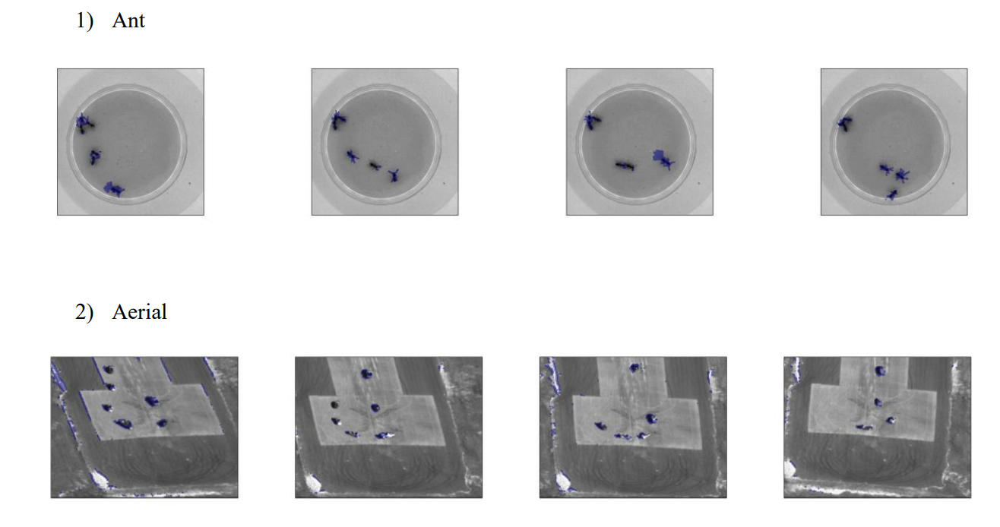
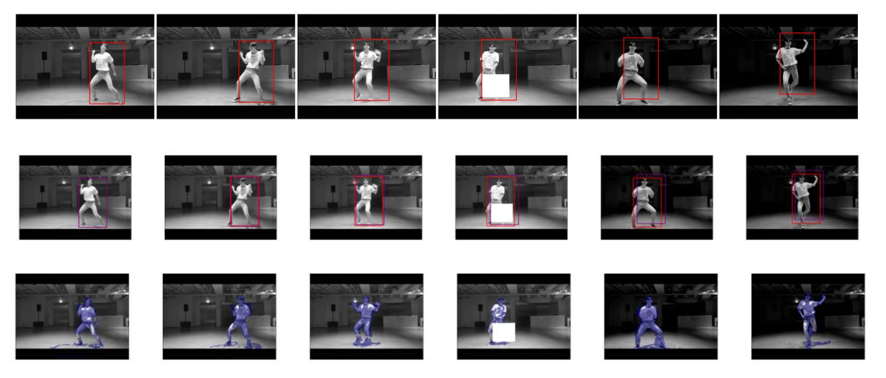

<!--https://github.com/othneildrew/Best-README-Template-->

  <h3 align="center">Lucas-Kanade Tracking</h3>
  

    16-720 Computer Vision: Homework 2 · Fall 2022
  

<!-- ABOUT THE PROJECT -->
## About The Project

Implement asimple Lucas-Kanade (LK) tracker with a single template. And implement a motion subtraction method to track moving pixels in a scene. Finally, efficient tracking using inverse composition.

### Built With: 
* Python 
* NumPy

(<a href="#readme-top">back to top</a>)

<!-- Results  -->
## Results 

_For the entire report, please refer to the [Documentation](https://github.com/jiyooonp/CMU-FALL-22/blob/main/cv-a/hw2/jiyoonp_hw2.pdf)_

1. Lucas-Kanade Tracking with One Single Template

2. Lucas-Kanade Tracking with Template Correction

3. Moving Object Detection

4. Track movement in video 

(<a href="#readme-top">back to top</a>)
