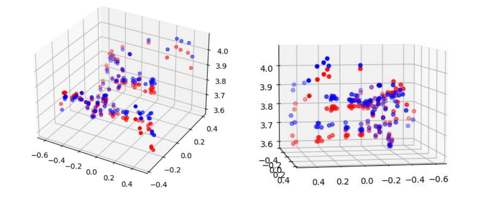
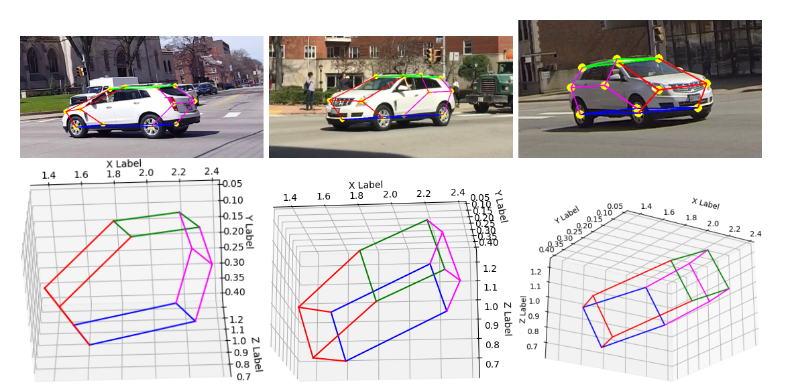

<!--https://github.com/othneildrew/Best-README-Template-->

  <h3 align="center">3D Reconstruction
</h3>
  

    16-720 Computer Vision: Homework 4 · Fall 2022
  

<!-- ABOUT THE PROJECT -->
## About The Project

Implemented an algorithm to reconstruct a 3D point cloud from a pair of images taken at different angles. Used the 8-point/7-point algorithm and triangulation to find and vizualize 3D locations of corresponding image points. 

### Built With: 
* Python 
* NumPy

(<a href="#readme-top">back to top</a>)

<!-- Results  -->
## Results 

_For the entire report, please refer to the [Documentation](https://example.com)_

1. The Eight Point Algorithm for calculating the fundamental matrix

2. The Seven Point Algorithm for calculating the fundamental matrix

3. 3D Visualization of point cloud 

4. Bundle Adjustment using RANSAC

5. Multi View Keypoint Reconstruction 

(<a href="#readme-top">back to top</a>)
